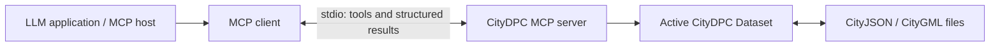

# Using the MCP server

The server wraps the separate [CityDPC open-source library](https://github.com/RWTH-E3D/CityDPC). Its original source, authorship and Apache-2.0 license are retained in the bundled `CityDPC/` directory; this project adds the MCP interface and evaluation.

## Architecture



Each server process owns one active dataset and an in-memory snapshot list. Load a dataset before querying or editing it. Independent clients/workflows should launch separate processes; the server does not provide per-user sessions within a process. Dataset contents stay in the server unless a tool returns them. Large responses such as `get_all_buildings` can still consume substantial model context.

## Installation and first connection

From the repository root, follow the installation in the [README](../README.md). The server itself needs no model API key. Your host application supplies the language model; the server supplies CityDPC functions.

For clients that accept the common `mcpServers` JSON format, adapt this configuration with **absolute paths**:

```json
{
  "mcpServers": {
    "citydpc": {
      "command": "/absolute/path/CityDPC-MCP/.venv/bin/python",
      "args": ["/absolute/path/CityDPC-MCP/mcp-server/cityDPC.py"],
      "env": {
        "MCP_DATASET_DIR": "/absolute/path/to/dataset-copies"
      }
    }
  }
}
```

Other clients use a different configuration file format but need the same command, argument and environment. On Windows the virtual-environment executable is `.venv\\Scripts\\python.exe`; the published smoke test was verified on macOS/Python 3.12. The client launches the server automatically. Starting it manually opens a stdio process waiting for an MCP client, not a web page or chat interface.

`MCP_DATASET_DIR` is optional. Its default is `mcp-server/data/datasets/`. Discovery lists `.gml` and `.json` files directly in that directory. Use `list_datasets` to get exact filenames and `load_dataset` with one of those filenames. Treat the configured directory as input organization, not an enforced filesystem security boundary.

Try the included client without an LLM:

```bash
python examples/query_dataset.py
```

## Suggested first prompts

- “List the available datasets, load evaluation.city.json and report the number of buildings.”
- “For the loaded dataset, return the ID and measured height of the highest building.”
- “Count the party-wall records returned by get_party_walls.”

The paper's sample has 36 buildings and 10 party-wall records. Record count is distinct from the number of participating buildings or total contact area.

## Editing and persistence

1. Load a working copy of the input file. Loading creates an initial snapshot and replaces the active state/history.
2. Use `take_snapshot` before an edit and retain the returned index.
3. Query the existing values; then call `enrich_building`, `create_building` or a removal tool.
4. Inspect the result. Use `rollback_to_snapshot` to restore an earlier in-memory state if needed.
5. Call `save_dataset` to write the current state to disk.

Snapshots are in memory only and disappear when the process ends. Rollback truncates later snapshots; it does not itself rewrite a file that was previously saved. `save_dataset(target_format="gml")` or `"json"` changes the output extension and current file path; exports use version 2.0. Back up source files separately.

`enrich_building(measured_height=...)` changes the semantic height attribute; it does **not** move geometry vertices. Likewise, roof metadata edits are not geometry reconstruction. Building creation uses CityDPC's supported LoD 0/1/2 constructions and roof types.

`filter_dataset` replaces the active dataset with a subset and clears history. Creating buildings, removing buildings and saving are blocked on a filtered dataset. Some attribute edits remain possible in memory. Reload the original to resume a complete dataset workflow.

## Troubleshooting

| Symptom | Check |
|---|---|
| Import error for `citydpc` or `fastmcp` | Install root requirements and point the client at the same virtual-environment Python. |
| No datasets listed | Check `MCP_DATASET_DIR`, file extensions and read access. |
| No active dataset / unknown building ID | Load a dataset first and query its IDs before requesting an individual building. |
| Changes disappear after restart | Use `save_dataset`; snapshots alone do not persist to disk. |
| Save rejected after filtering | Reload the complete dataset before editing and saving. |
| Surface planarity warnings | The library detected non-planar geometry. A successful import or smoke test does not prove geometric correctness. |
| Server waits after manual startup | Expected for stdio; connect through an MCP client. |

See the [tool reference](tools.md) for exact names and parameters and the [evaluation guide](../evaluation/README.md) for model benchmarks.
